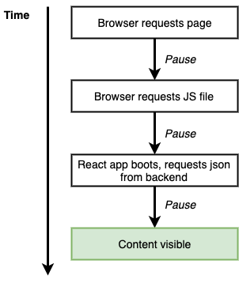
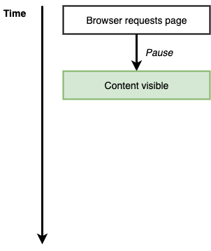
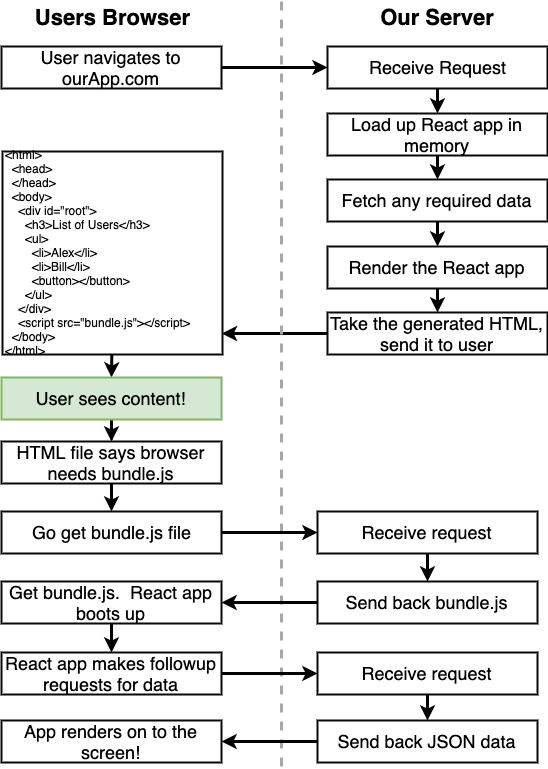

# React : Server Side Rendering

### Client Side Rendering

Most of all, we have started to working with `create-react-app` cli for react setup in client side.

#### How client side application rendering

**step 1:**  `Browser requests page`  which will have base html along with scripts registered.

**step 2:**  `Browser requests .js files`  which has react code and app dependent files.

**step 3:**   `React app boots` our React App code will be initialised and loads data from backend.

**step 4:**  `Content visible`  after successful of above steps, Content will be visible to user.

At initial load, client side react application needs some time to render our app. User has to wait some time to see content. This is main concern in client side application.

### Server Side Rendering

To avoid above situations and to show UI at initial load, we need server side rendering approach.

#### How server side application rendering

**step 1 :** `Browser requests page`which will have html tags of all pre-rendered components at server side along with script declaration

**step 2:** `Content visible` Now content will be visible to us. because components are rendered at server side and sends those html. 

This is the advantage of server side rendering. User can see their contents at initial render.

We have just seen the overview of how ssr quickly responds on your page load. 

Now we will see what happens on SSR approach in detail

Using React in server side is differing load time at initial load. Rest of things are happened in client side. 

